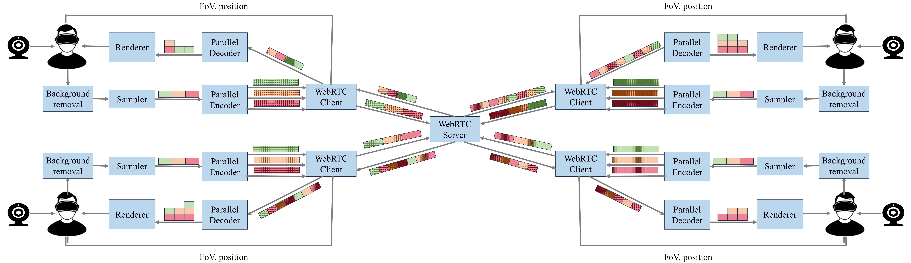

# Many-to-many WebRTC-based point cloud video conferencing

In this repository, all files related to a multi-party volumetric video-based system are made available. Five parts are considered:

- A [Unity project](unity) written in C#, used to create sessions and render point cloud video
- A [WebRTC framework](webrtc) written in Golang, used to interconnect peers through a selective forwarding unit (SFU)
- A [connector plugin](connector) written in C++, used to interconnect the Unity application to the WebRTC client (currently incomptabile)
- A [point cloud capturer plugin](point_cloud_capturer) written in C++, used by the Unity application for capturing (at the moment only realsense is supported)
- An [encoder plugin](mdc_encoder) written in C++, used by the Unity application the captured point clouds using a MDC-based approach (uses Draco for encoding)

The system is currently under development by IDLab, Ghent University - imec. This README will be updated while development continues, with detailed instructions for each of these components.

## Architecture

The developed system supports multi-party point cloud delivery using a multi-description coding (MDC) approach. In contrast to traditional approaches - which either compress point cloud frames as a whole or apply spatial segmentation in the form of tiles - our solution creates several distinct subsets (descriptions) of sampled points. Each of these descriptions can be encoded separately, resulting in lower processing times due to parallelization. Furthermore, multiple descriptions can be merged together after decoding, resulting in a representation of higher visual quality.



As shown in the above illustration, our solution provides a fixed number of encoders per participant, corresponding to the number of descriptions. The number of local decoders for each client scales with the number of received descriptions. The SFU unit decides on what descriptions will be forwarded to each client, taking into account the user's field of view (FoV) and position in the sence, as well as the bandwidth that is available to the client (estimated through [Google congestion control](https://datatracker.ietf.org/doc/html/draft-ietf-rmcat-gcc-02)).

For a more detailed explanation of the system, we refer to our recent publications [1, 2].

[1] M. De Fré, J. van der Hooft, T. Wauters, and F De Turck. "Demonstrating Adaptive Many-to-Many Immersive Teleconferencing for Volumetric Video", Proceedings of the 15th ACM Multimedia Systems Conference, 2024 (available [here](https://backoffice.biblio.ugent.be/download/01HW2J0M02RWJSSFSGP8EEDQ1B/01HW2J41RKP8CXHFTR22D2ARNQ))

[2] M. De Fré, J. van der Hooft, T. Wauters, and F De Turck. "Scalable MDC-Based Volumetric Video Delivery for Real-Time One-to-Many WebRTC Conferencing", Proceedings of the 15th ACM Multimedia Systems Conference, 2024 (available [here](https://backoffice.biblio.ugent.be/download/01HW2J66EZD49XQD2P94JBXHKR/01HW2J8F937QNC36XHZEBRHE8K))

## Installation

For the basic use case you will only need to build and run the [SFU server](https://github.com/idlab-discover/pc-webrtc-m2m/tree/main/webrtc) and the [Unity application](https://github.com/idlab-discover/pc-webrtc-m2m/tree/main/webrtc).

To build the SFU you will need to make sure you have installed the [latest version of Golang](https://go.dev/doc/install). If this is the case you will be able to simply do `go build -o SFU_server.exe ./sfu` in the [root of the WebRTC diretory](https://github.com/idlab-discover/pc-webrtc-m2m/tree/main/webrtc) to build the SFU. This process will automatically download any nessesary dependencies.

Simelary, you are able to build the client WebRTC application if you need to make changes to it. However, you will need to make sure that the Unity application will also make use of this. To do this you will have to the existing [peer.exe](TODO) of the Unity application.

Building the Unity application follows a very similar flow. First you will have to open the [unity](unity) folder of this repository in Unity hub. Doing so will automatically download any dependencies. Once inside you are able to build the application like any other Unity application.

> :exclamation: At the moment you will have to manually copy the `config` and `peer` directories from the `Assets` directory to the [Unity application datapath](https://docs.unity3d.com/ScriptReference/Application-dataPath.html) (In Windows this is: `spirit_unity_Data`).

### Realsense

Capturing is done with a using a [custom Dll](TODO). If you plan to make changes to it, you will have to manually copy it into the `Plugins` directory after building it.

Currently the application only supports Intel Realsense cameras as a means to capture the point clouds. Make sure your system has the nessecary libraries and drivers installed. If this is not the case follow the instructions below:

For Windows you can just download and run the [latest SDK](https://github.com/IntelRealSense/librealsense/releases) which automatically includes all nessacties.

For Linux you will to follow the commands listed on [this page](https://github.com/IntelRealSense/librealsense/blob/master/doc/distribution_linux.md), to properly install the SDK without having to manually build it.
 

### WebRTC Connector
The Unity application uses a Dll to connect to the Golang WebRTC application via sockets. Normally you should never have to build this yourself as the repository contains the latest version.

However, if you do plan 


For more information about the Dll you can visit the [README](TODO) of the WebRTC Connector.

## Usage

The first step you need to is make sure that an instance of the SFU server is running. Assuming that you have build this you are able to start with the following command: 

```
`./SFU-Server --addr 0.0.0.0:8000 -t 3`
```
You are allowed to use any valid address and port for the value of `--addr`. When you use `0.0.0.0` it will automatically listen on every interface. The value of `t` is the maximum number of video tracks a client is going to transmit, i.e., if you have three base descriptions this value will be three.

Once the server is running, you can start the clients. For these you need to make sure that their configuration file has the correct parameters, and that its placed in a `config` directory in the [Unity application datapath](https://docs.unity3d.com/ScriptReference/Application-dataPath.html). You can find an example config file [here](TODO). The most important parameter you will have to change is the `sfuAddress`, which needs to be changed to the address of your SFU server (note: you will have to change this even if you are using `0.0.0.0` for the server). 

The second most important parameter is the `peerUDPPort` this parameter determines which local port will be used to communicate with the Golang WebRTC application. You will only need to change this if you are playing to run multiple clients on the same machine.

Finally, the `clientID` parameter determines the position at the table as follows:

TODO picture of table positions

You can visit the [README](TODO) of the Unity application for more information about the other parameters.

A client is always able to leave and reconnect to the same session, and doing so will make them reappear at place at the table.

TODO DASHBOARD
## Funding

This work is funded by the European Union [SPIRIT project](https://www.spirit-project.eu), grant agreement 101070672.


